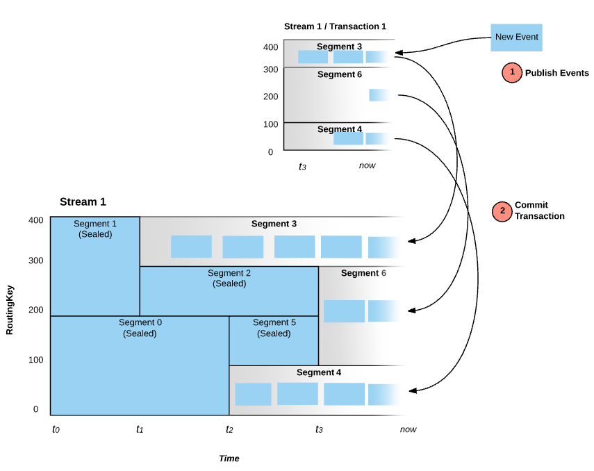

# Pravega

<v-clicks depth=3>

 - PubSub à la Kafka / Pulsar
   - Streams (topics)
   - Key Value Pair tables 

 - Long term storage (NFS, HDFS, S3)
 - Elastic Streams (topics)
    - Scales up and down automaticaly
      - Rates (event/s)
      - Volume (Mo/s) 
  - Efficient at high partition counts
  - Exactly once semantics
  - Native transactions

</v-clicks>

---

# Pravega / Streams and Tables

---

# Pravega

 - PubSub à la Kafka / Pulsar
 - Long term storage (NFS, HDFS, S3)
 - Elastic Streams (topics)
    - Scales up and down automaticaly
      - Rates (event/s)
      - Volume (Mo/s) 
  - Efficient at high partition counts
  - Exactly once semantics
  - Native transactions

---

# Pravega / Auto Scaling

---

# Pravega / High Partition Counts

  

    
  

<v-clicks depth=3>

   - partitions, millions !
   - high throughput
   - low latency
   - high dynamicity (number of partitions)
</v-clicks>

---

# Pravega / Consistency Guarantees

### Exactly once semantics

Streams are append only.

<v-clicks depth=3>

 - Durable
 - Consistent
 - Ordered
 - Transactional

</v-clicks>

---

# Pravega / Elastic Streams

