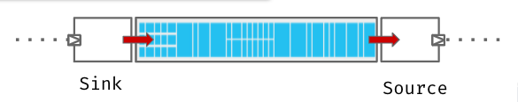

# ZIO Pravega / Demo time

[ZIO Pravega](https://github.com/cheleb/zio-pravega/) is a ZIO Scala library for Pravega.


---

# Stateful Stream Processing

## Source-Sink



````md magic-move
```scala
private val program = for {
    _ <- ZIO.debug("Writing to stream")
    _ <- testStream(1, 10) >>> PravegaStream.sink("a-stream", stringWriterSettings)
    _ <- ZIO.debug("Done")
} yield ()

```
```scala
  private val program = for {
    _     <- PravegaReaderGroupManager.createReaderGroup("a-reader-group", "a-stream")
    stream = PravegaStream.stream("a-reader-group", stringReaderSettings)
    count <- stream.tap(m => ZIO.debug(m)).take(10).runCount
    _     <- Console.printLine(f"Read $count%d elements.")
  } yield ()

```
````
---

# Stateful Stream Processing

## Key-Value Processing


---

````md magic-move
```scala
def updateTask(k: K, v: V, combine: (V, V) => V): Task[UpdateAndNewValue[V]] = ZIO
    .fromCompletableFuture(table.get(tableKey(k)))
    .map {
      case null     => insert(k, v)
      case previous => merge(k, v, previous, combine)
    }
```
```scala
def updateTask(k: K, v: V, combine: (V, V) => V): Task[UpdateAndNewValue[V]] = ZIO
    .fromCompletableFuture(table.get(tableKey(k)))
    .map {
      case null     => insert(k, v)
      case previous => merge(k, v, previous, combine)
    }

/**Upsert a value in a Pravega table, will retry forever.
 */
def upsert[K, V](
    k: K,
    v: V,
    table: PravegaKeyValueTable[K, V],
    combine: (V, V) => V
  ): Task[(Version, V)] =
    for {
      updateMod <- table.updateTask(k, v, combine)
      result    <- table.pushUpdate(updateMod)
    } yield result
```
```scala
def updateTask(k: K, v: V, combine: (V, V) => V): Task[UpdateAndNewValue[V]] = ZIO
    .fromCompletableFuture(table.get(tableKey(k)))
    .map {
      case null     => insert(k, v)
      case previous => merge(k, v, previous, combine)
    }

/**Upsert a value in a Pravega table, will retry forever.
 */
def upsert[K, V](
    k: K,
    v: V,
    table: PravegaKeyValueTable[K, V],
    combine: (V, V) => V
  ): Task[(Version, V)] =
    (for {
      updateMod <- table.updateTask(k, v, combine)
      result    <- table.pushUpdate(updateMod)
    } yield result).retry(Schedule.forever)
 
 
```
````